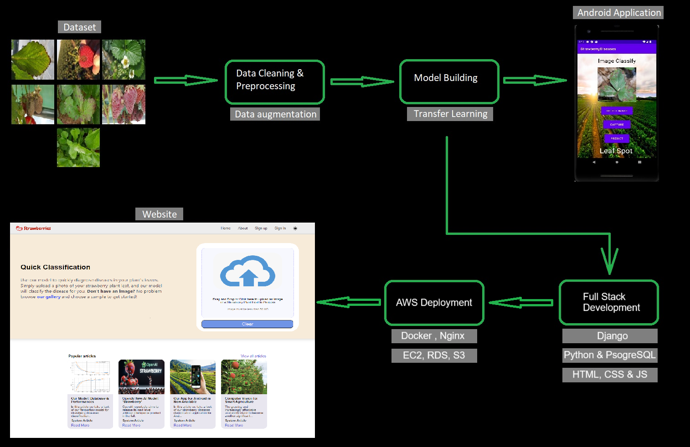

# Classification Web Application

## About

[www.aiStrawberries.com](https://www.aiStrawberries.com) is an innovative platform designed for strawberry enthusiasts, farmers, and tech-savvy users alike. Our website allows users to easily classify strawberry plant leaf diseases using advanced image recognition technology. Simply upload an image, and our AI-driven system will provide an accurate diagnosis, helping you manage your strawberry crops effectively.

In addition to disease classification, aiStrawberries serves as a rich resource for articles on a variety of strawberry-related topics. Whether you're interested in sustainable agriculture practices, delicious strawberry shake recipes, or detailed information about common plant diseases, our platform has you covered.

We also feature cutting-edge articles on artificial intelligence and computer vision, exploring how these technologies are transforming agriculture and beyond. We recommend signing up for our platform and subscribing to our newsletter to receive our best articles and news before anyone else!

So click on the Subscribe button and join us to explore the world of strawberries and discover the latest advancements in AI and precision farming, all in one place! 

https://private-user-images.githubusercontent.com/107938584/374960217-17af9d06-baf6-48c8-84cc-ee3b440ffc11.mp4?jwt=eyJhbGciOiJIUzI1NiIsInR5cCI6IkpXVCJ9.eyJpc3MiOiJnaXRodWIuY29tIiwiYXVkIjoicmF3LmdpdGh1YnVzZXJjb250ZW50LmNvbSIsImtleSI6ImtleTUiLCJleHAiOjE3Mjg0Nzc3NTEsIm5iZiI6MTcyODQ3NzQ1MSwicGF0aCI6Ii8xMDc5Mzg1ODQvMzc0OTYwMjE3LTE3YWY5ZDA2LWJhZjYtNDhjOC04NGNjLWVlM2I0NDBmZmMxMS5tcDQ_WC1BbXotQWxnb3JpdGhtPUFXUzQtSE1BQy1TSEEyNTYmWC1BbXotQ3JlZGVudGlhbD1BS0lBVkNPRFlMU0E1M1BRSzRaQSUyRjIwMjQxMDA5JTJGdXMtZWFzdC0xJTJGczMlMkZhd3M0X3JlcXVlc3QmWC1BbXotRGF0ZT0yMDI0MTAwOVQxMjM3MzFaJlgtQW16LUV4cGlyZXM9MzAwJlgtQW16LVNpZ25hdHVyZT1kMTVlY2MwMmJkZGNiYjAwNmM1ZDM0ZGQyNmI0NzgwYmJkZjQ1MzhiMmI3OGEyYjJmY2MwZDI0ZTk4ODJiNjdlJlgtQW16LVNpZ25lZEhlYWRlcnM9aG9zdCJ9.UfUSTHbaMiXT-boyVmuKGh1NEzOOSyFsUNOwJ6AgRDw

## Technologies

In my project, I utilized a diverse stack of technologies to build a full-scale web and mobile application. On the backend, I developed the core functionality using **Django** and **Python**, managing server-side logic and data processing. For the frontend, I used **HTML**, **CSS**, and **JavaScript**, ensuring a user-friendly interface, all within the Visual Studio Code environment.

To build and train the AI model for classifying strawberry diseases, I worked Google Colab and employed popular libraries such as **TensorFlow**, **OpenCV**, **NumPy**, **Matplotlib**, and **os** for data processing, model building, and visualization. You can read more about our model [here](https://aistrawberries.com/articles/2/).

The project was deployed on **AWS** **EC2** for hosting the web server, with **Nginx** as the reverse proxy, and I used **Docker** for containerization. Additionally, I utilized **AWS** **S3** for storage, ensuring data availability and security. For data management, I integrated **PostgreSQL** as the database system, hosted on **AWS** **RDS** (Relational Database Service).
The TensorFlow model was deployed using a serverless **SageMaker** endpoint.

The Android application, built using **Android Studio** with **Java**, features **TensorFlow Lite** for on-device AI predictions, allowing users to classify strawberry plant diseases directly from their mobile devices. 
Read more about our app [here](https://aistrawberries.com/articles/1/).

## Graph

